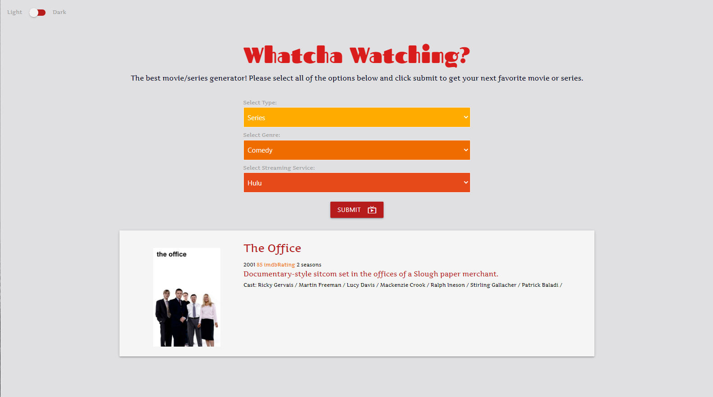

# Whatcha Watching

## Description  
Ever looking for something to watch, whether it be a movie or a new series, and have trouble setttling on something as time keeps being wasted? Well fear no more. This movie/series generator is built to randomly select an option for the user based on the user's preferences. There are three input rneeded from the user before a selection is made. The first required input is whether the user is looking for a movie or series. The second input is the genre of moive/series the user will want to watch. And the last is the streaming service the user will be utilizing to watch a given movie/series. Once these three inputs have been entered utilizing the dropdowns, the user may click submit and a selection will appear towards the bottom of the page.  
Warning: There are a few combinations of inputs that do not yield results. For these, the selection box that appears after the user clicks sumbit should instruct the user to change one of the previous inputs in an attempt to find a combination that will provide a result.

## Table of Contents  
[Description](#description)    
[Usage](#usage)  
[License](#license)   
[Tests](#tests)  
[Questions](#questions)  

## Usage  

[Link to Deployed App](https://colinmchale.github.io/whatcha-watching/)  
This application was made for those in need of new movie and/or series suggestions given their specific streaming platforms. Built utilizing Javascript, React, and Materialize.

## License 
MPL 2.0
[Link to License](https://www.mozilla.org/en-US/MPL/2.0/)

## Tests  
Select one of the dropdown options in each of the three input sections and click submit. The user should receive a movie/series recommendation, and if not, should receive a warning that there are no movies/series available for the user sumbitted selections. Please also test that the colors of the application change as the user clicks on the light/dark switch in the upper left corner.

## Questions
Link to github: [Click Here](https://github.com/colinmchale)  
Please submit any additional questions you may have in an email to colin.mchale22@gmail.com
